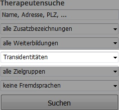

> Work in progress. Diese Seite befindet sich noch im Aufbau. Bitte kommt später vorbei (oder macht nen pull-request).

>*Hi, this page is, obviously, written in German. Please contact us, or open a pull request, if you would like to see it translated.*
<!-- cSpell:language de -->

# Über diese Seite
Diese Seite wurde von der Trans-Community in Vorarlberg erstellt und soll euch bei eurer Transition helfen, indem wir versuchen, häufig aufkommende Fragen zu klären.

## Keine verbindlichen Informationen
Die hier zu findenden Informationen sind stammen aus unserer Community und bilden das Wissen, persönlichen Erfahrungen und Meinungen diverser Personen ab. Wir erheben keinen Anspruch auf Vollständigkeit, Korrektheit, Aktualität etc. 

Wir versuchen jedoch, wo wir können, auf die jeweiligen Quellen zu verweisen.

# Inhalt
* [Tipps, Infos und Alltägliches](alltaegliches.md)

# Psychotherapie
Wir haben in Vorarlberg zwei Psychotherapeutinnen, die über Transgender-Kompetenzen verfügen:

* [Gunhild Häusle-Paulmichl, Mag.ª, Dr. phil., MSc](http://www.vlp.or.at/users/view/99) in Feldkirch
* [Margit Türtscher-Drexel, Dr.](http://www.vlp.or.at/users/view/235) in Dornbirn

Eine aktuelle Liste aller Therapeut\*innen findet ihr beim [Vorarlberger Landesverband für Psychotherapie (VLP)](http://www.vlp.or.at/users/find). Nach den für uns wichtigen Therapeut\*innen mit Arbeitsschwerpunkt *Transidentitäten* könnt ihr beim VLP suchen: wählt dazu *Transidentitäten* statt *alle Schwerpunkte* aus.

## Kosten
TODO: Infos

# Grundlagen zur Transition

(TODO: Anderer Prozess zu Kindern & Jugendlichen!)
Indikationsstellung, Fallführende etc.
Individuell, keine Pflicht etc.

## Unterlagen, Unterlagen, Unterlagen

Nehmt grundsätzlich immer Kopien von **allen** Unterlagen (Stellungnamen, Diagnosen etc.) mit, selbst wenn ihr die schon einmal abgegeben habt oder euch versichert wurde, dass die Unterlagen weitergeleitet werden. 
Es ist ansonsten sehr ärgerlich wenn man, möglicherweise nach monatelanger Wartezeit, endlich einen Termin für eine Untersuchung hat und dann unverrichteter Dinge wieder gehen muss, bloß weil wieder irgendein Dokument fehlt.

Ja selbst bei den Ärzten selbst gehen gern Unterlagen verloren. Wir scheinen da immer besonders viel Glück zu haben - also: nehmt immer alle Unterlagen mit, die ihr finden könnt. 

# Namens- und Personenstandsänderung
TODO: Immer eine Kopie mitführen (Stellungname, ...)

## Psychotherapeutische Stellungnahme #1
## Ablauf
## Dauer & Kosten
## Folgen
TODO: Bürokratie. Wo online, telefonisch, email oder schriftlich per post notwendig.

* Bank: vorher telefonisch abklären! Kann persönlich sein, per Post (z.B.: falls )
* Verträge
  * Handy: Post (bob)
  * Internet: 
  * Versicherung
* Amazon (online)
* Netflix (E-Mail)

Besonderheiten Versicherung/E-card (mehrfach, falsches Geschlecht usw)

# Hormonersatztherapie (HET) / Hormone Replacement Therapy (HRT)

Nur nach N-/PSÄ.
(Kostenübernahme?)

## Stellungnahme HET
Klinisch-Psychologisch oder Psychotherapeutisch
Psychiatrische Kontrolluntersuchung

## Ärzliche Untersuchungen

Welche Untersuchungen, warum

### Hormonbasisdiagnostik
Hausarzt? Oder beim Urologen/Gynäkologen.

### Urologische/Gynäkologische Untersuchung
### Internistische Untersuchung
### Persönliche Erfahrungen
Welche Ärzte kennen wir, wie trans-freundlich und kompetent empfunden?

### Gynäkologische Endokrinologie (Hormonfreigabe)

Zum Schluss, wenn alle Stellungnahmen & Befunde. 

## Hormone und Blocker
Welche Möglichkeiten? Anwendungsunterschiede, Aufbewahrung

### Estrogel
Rezept Hausarzt (erstes Ibk)
Gel, "Seifenspender", Alkoholgeruch, 2-10 Minuten Einziehen. Innenschenkel oder Arme. Niemals Brüste!. Dosis auf einmal oder z.B. 2x am Tag.
Menge: so wie verordnet (Beginn HRT meist 2 Hübe)
Kühl lagern (nicht über 25°C) - Kühlschrank, Kühltasche. Sonst Wirkungslos.

### Pamorelin (Blocker)
Rezept Hausarzt (erstes Ibk)
Blocker, 3-Monate Depot, Hausarzt, Intramuskulär. 

### Testo

### Zeitlicher Ablauf
Was nach welcher Zeit, welche Ergebnisse sind zu erwarten (und was nicht).

# Operative Eingriffe

(Kostenübernahme Ablauf?)
GaOp (Frau), Brustaufbau; Mastektomie, GaOp (Mann);

Keine Kostenübernahme bei Schönheits/Kostmetischen-OPs. Vielleicht besser keinen Fokus darauflegen, muss jedeR selber wissen.

## Stellungnahme vor operativen Eingriffen notwendig
TODO
Klinisch-Psychologisch oder Psychotherapeutisch
Psychiatrische Kontrolluntersuchung

## Transfrauen

### GaOp
Orte: Feldkirch, Innsbruck, TODO
Kombinierbarkeit mit Brustaufbau (eventuell aber warten bis Brustwachstum abgeschlossen ist)
Notwendige Gutachten, Untersuchungen usw.
Krankenstanddauer/Heilprozess, Korrektur, Risiken, Dilation, …

### Brustaufbau

## Transmänner

### Mastektomie
### 

## etc. TODO

# Dauerhafte Haarentfernung (Lasern, Bart, …)

Empfohlen nach NÄ/PSÄ wegen Kostenzuschuss.
## Kostenzuschuss abklären
Krankenkasse, VGKK Rigger

## Hautarzt
Nur Hautärzte. Diagnose notwendig für Kostenzuschuss. 
Kein Kostenzuschuss bei Studio. Studio eher nicht zu empfehlen weil keine Hautärzte, persönliche Erfahrungen rausgeschmissenes Geld.

### Persönliche Erfahrungen

## Laser/IPL
Unterschied, Schmerzen, Vorbereitung, Sonnencreme

## Dauer & Kosten
"6-10" eher "min 20" Behandlungen

Bart 5-10 Minuten, ?€

# Logopädie (Sprachtraining)

# Tipps, Infos und Alltägliches
Sachen die wir eventuell auch erst lernen mussten
## Weiblich präsentierend
### Kleidung und Mode
Begriffe, Ideen, aktuelle no-gos bzw. was passt eher zu mir?; Bezugsmöglichkeiten; Gemeinsames Shopping; Was wie kaschieren, Kleidungsauswahl für einen weiblicheren Auftritt (sofern gewünscht);

### Makeup
Wer will; Woher, wie lernen; Kosten; Nicht schminken wenn am Lasern;

### Brusteinlagen/Epithesen
BH stopfen, Silikoneinlagen, verschiedene Epithesen, selbsthaftend/-klebend oder Tasche; Reinigung; Abfallende Brüste im Sommer;

## Männlich präsentierend
### Binder
Welche Möglichkeiten, worauf achten